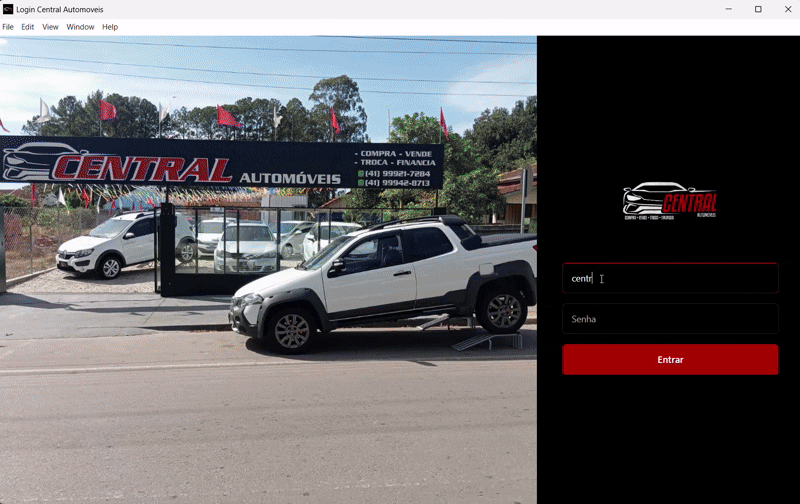

<p align="center">
# 🚗 Central Automóveis
</p>

**Central Automóveis** é uma aplicação completa para cadastro, controle e gerenciamento de veículos para lojas de carros. O sistema permite administrar o estoque de automóveis de forma prática, integrando um backend robusto a um banco de dados relacional.


---

## 🛠️ Tecnologias Utilizadas

O projeto foi desenvolvido utilizando as seguintes tecnologias:

### Frontend
- **HTML5 & CSS3** – Estruturação e estilização moderna da interface.
- **JavaScript (ES6+)** – Dinamismo, consumo de API e manipulação do DOM.

### Backend & Banco de Dados
- **Node.js** – Ambiente de execução do servidor.
- **Express** – Framework para gerenciamento de rotas e APIs.
- **PostgreSQL** – Banco de dados relacional para persistência de dados.

### Ferramentas de Deploy & Build
- **Electron** – Arquitetura de empacotamento desktop (se aplicável).
- **Vercel** – Hospedagem do ecossistema frontend.

---

## 🚀 Como Executar o Projeto Localmente

### Pré-requisitos
Antes de começar, você vai precisar ter instalado em sua máquina:
- [Node.js](https://nodejs.org)
- [PostgreSQL](https://postgresql.org)

### Passo a Passo

1. **Clonar o repositório:**
   ```bash
   git clone https://github.com
   cd CentralAutomoveis
   ```

2. **Configurar as variáveis de ambiente:**
   Crie um arquivo `.env` na raiz do projeto (com base no seu arquivo `.env` local) e adicione as credenciais do seu banco de dados PostgreSQL e porta do servidor.

3. **Instalar as dependências:**
   ```bash
   npm install
   ```

4. **Iniciar o banco de dados:**
   Certifique-se de que o serviço do PostgreSQL está rodando e crie as tabelas necessárias utilizando seus scripts SQL de configuração do banco.

5. **Iniciar a aplicação:**
   Você pode rodar o script automatizado ou iniciar o servidor diretamente:
   ```bash
   # Executando via arquivo batch (Windows)
   ./start_app.bat

   # Ou iniciando o servidor Node diretamente
   npm start
   ```

---

## 📂 Estrutura Principal do Projeto

```text
├── backend/            # Servidor Express e regras de negócio
│   └── src/            # Código-fonte das rotas e controladores do backend
├── frontend/           # Interface web (páginas, estilos e scripts do cliente)
├── .env                # Variáveis de ambiente (ignorado no GitHub)
├── ecosystem.config.js # Configuração para gerenciadores de processo (PM2)
├── server.js           # Ponto de entrada principal do servidor Node
├── start_app.bat       # Script de inicialização rápida no Windows
└── vercel.json         # Configurações de deploy para a Vercel
```

## 📹 Vídeo demonstrativo

<p align="center">
  
</p>
---

## 👨‍💻 Desenvolvedor

* **Patrick Feltrin** - [https://github.com/pfeltrin](https://github.com/pfeltrin)

---
<p align="center">Desenvolvido para portfólio profissional 💻</p>
